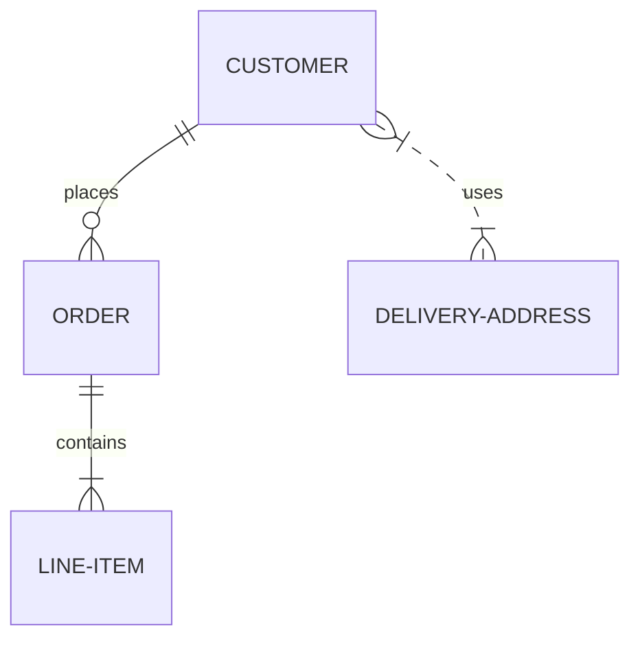

# README.md ファイルのマークアップ記述
README.mdはGitHub上のプロジェクトの説明に使われ、マークダウンのマークアップ言語で記述されます。何がどのようにサポートされているかは後述します。また、[reStructuredText](https://github.com/GnuriaN/format-README/blob/master/README.rst) というフォーマットもあります。これは別のファイル `README.rst` で説明されています。

## 目次

0.[セパレーター](#セパレーターダッシュ)
1.[見出し](#Headings)
2.[テキスト選択で作業](#テキスト選択で作業)
3.[絵文字を使う](#Use-emoji-emoji)
4.[引用をテキストで使う](#Use-citations-in-text)
5.[コードハイライト](#Code highlighting)
6.[リスト](#Lists)
    1.[マーク](#マーク)
    2.[番号付き](#番号付き)
    3.[混合リスト](#Mixed-Lists)
    4.[タスクリスト](#タスクリスト)
7.[リンク](#リンク)
8.[画像の挿入](#Insert-Image)
9.[表の挿入](#Insert Tables)
10.[Mermaid.jsチャート](#diagrams-mermaidjs)
11.[アドイン](https://github.com/GnuriaN/format-README/blob/master/Дополнения.md)
    
## セパレーター
を使用する場合
```
____
```
を使用すると、区切り文字
____
[:arrow_up:目次](#目次)
___
## 見出し

見出しは全部で6段階あります。見出しを作成するには、行頭にそのレベルと同じ数の `#` 文字を追加しなければなりません。
____
## 第一レベルの見出し
```
# 見出し1
```
第一レベルヘッダも作成できる：
```
見出し1
===========
```
____
## 第2レベルヘッダ
```
## 見出し2
```
第2レベルのヘッダーも作成できる：
```
見出し2
-----------
```
____
### 第3レベルの見出し
```
### 第3見出し
```
____
#### 第4レベルヘッダ
```
#### 第4見出し
```
____
##### 第 5 階層見出し
```
##### 見出し5
```
____
###### 第六階層見出し
```
###### 見出し6
```
____
[:arrow_up:目次](#目次)
____
## テキスト選択の操作

```
~~テキストを線引きする~~
```
~~テキストを取り消す

また、`*` や `_` を使うと、**`太字** や *`斜体** にすることができます。

```
テキストを**太字(ボールド)**にする。
```
**テキストを太字にします。

```
*イタリック体
```
** イタリック体

```
*** 太字イタリック体
```
*** 太いイタリック体）*** ```

```
太字テキスト(ボールド)
```
太字テキスト(太字)

```
_斜体のテキスト（イタリック） _
```
_斜めのテキスト(イタリック)_ ```

```
太字の斜体のテキスト(太字の斜体)___
```
太字の斜体のテキスト (太字の斜体)__ ```

```
~~*♪ ♪ ♪ 変なテキストがある ♪ ♪~~
```
~~ 変なテキストがある__*~~~
    
[:arrow_up:目次](#目次)
____
## 絵文字を使おう
テキスト自体に絵文字を使うことができます。例えばこんな風に書いてみましょう：
:white_check_mark:これはすでに行われました。
:negative_squared_cross_mark：やりません。
:black_square_button: やるかやらないか、それが問題だ。    
原文では次のようになっています（行末にスペースが4つあるので、改行されます）：
```
:white_check_mark: もう終わっています。
:negative_squared_cross_mark: やりません。
:black_square_button: やるかやらないか、それが問題だ。    
```

使える絵文字の一覧はこちら -> [emoji.md](https://github.com/GnuriaN/format-README.md/blob/master/emoji.md)
    
[:arrow_up:目次](#目次)
___
## 本文中で引用を使用する
```
> 引用（レベル1）
> ネストされた引用(レベル2)
> ネストされた引用（レベル3）

> 引用（レベル2）

> 引用の続き（レベル1）
```
> 引用（レベル1）
> > 入れ子引用（レベル2）
> > 入れ子の引用（レベル3）

> 引用（レベル2）

> 引用の継続（レベル1）

確かに見栄えは良くないが、重宝するかもしれない。

[:arrow_up:目次](#目次)
___
## コードハイライト

文字列内の単語やフレーズをハイライトしたい場合は、シングル・バッククオート (`) を使用します：

    この`単語`がハイライトされます

ブロック単位でハイライトするには、三重引用符を使う：

    ```
        以下のようになります。
        広告
    ```

さらに、最初の3つの引用符の後に指定することで、ブロック内でコード言語を指定することができます：

    ```html
        <input type="text">
    ```

    ```css
        ボディ
            margin: 0；
            padding: 0；
        }
    ```

    ```php
        <?php phpinfo();?
    ```

C#` のブロック例

```C#
MarkdownSharp.Extensions.Malを使用しています；
を使用しています；

Markdown mark = new Markdown()；

// MALのショート・リンク
// http://myanimelist.net/people/413/Kitamura_Eri => mal://Kitamura_Eri
mark.AddExtension(new Articles())；
mark.AddExtension(new Profile())；

mark.Transform(text)；
```

Pythonのブロック例です：
```Python
from timeit import タイマー

tmp = "Python 3.2.2 (default, Jun 12 2011, 15:08:59) [MSC v.1500 32 bit (Intel)] on win32."

def case1()：# A. ループ内でのインクリメンタルな連結
    s = ""
    for i in range(10000)：
        s += tmp

def case2()：# B. 中間リストとjoinメソッド経由
    s = []
    For i in range(10000)：
        s.append(tmp)
    s = "".join(s)

def case3()：# B. リスト式とjoinメソッド
    return "".join([tmp for i in range(10000)])

def case4()：# D. 生成式と結合メソッド
    return "".join(tmp for i in range(10000))

for v in range(1,5)：
    print (Timer("func()", "from __main__ import case%s as func" % v).timeit(200))
```
    
[:arrow_up:目次](#目次)
___
## リスト

#### マーク
数文字の `-`, `+`, `*` で **ラベル付き** リストを指定することができます：
```
- リストのレベル 1.項目 1。
- リストレベル 1.項目 2.
- リストレベル 1.項目 3.
```
- リスト・レベル 1.項目 1.
- リスト・レベル 1.項目 2.
- リストレベル 1.項目 3.

```
+ リスト・レベル 1.項目 1.
+ リスト・レベル 1.項目 2.
+ リストレベル1.項目 3.
```
+ リストレベル 1.項目 1.
+ リストレベル1.項目 2.
+ リストレベル1.項目 3.

```
* リスト・レベル 1.項目 1.
* リスト・レベル 1.項目 2.
* リスト・レベル 1.項目 3.
```
* リスト・レベル 1.項目 1.
* リスト・レベル 1.項目 2.
* リスト・レベル 1.項目 3.

複数レベルのリストを作成することができます。各レベルは4つのスペースで区切られます：
```
- リストレベル 1.項目1。
    - リストレベル2。項目1。
- リスト・レベル 1.項目 2.
    - リストレベル2項目 1.
    - リスト・レベル 2.項目 2.
- リストレベル1項目 3.
    - リストレベル2項目 1.
        - リストレベル3項目 1.
        - リストレベル3項目 2.
           - リストレベル4項目 1.
```
- リストレベル1。項目 1.
  - リスト・レベル 2.項目 1.
- リスト・レベル 1.項目 2.
    - リストレベル2項目 1.
    - リスト・レベル 2.項目 2.
- リストレベル1項目 3.
    - リストレベル2項目 1.
      - リストレベル3項目 1.
      - リストレベル3項目 2.
         - リストレベル4項目 1.

各レベルは2つのスペースで区切られる。

#### 番号付き
Githibにとって、番号付きリストを使った作業はとても面白そうです。各レベルは4つのスペースで区切られます：
```
1.最初のレベル 1
    1.第二レベル 1
        1.第3レベル 1
            1.第4レベル 1
                1.第5レベル 1
                    1.第6レベル
                        1.第7レベル
                            1.第7レベル
2.第1レベル 2
2.第1レベル（3であるべき）
4.第1レベル 4
```
1.第1レベル 1
    1.セカンド・レベル 1
        1.第3レベル 1
            1.第4レベル 1
                1.第5レベル 1
                    1.第6レベル
                        1.第7レベル
                            1.第7レベル
2.第1レベル 2
2.第1レベル（3であるべき）
4.第1レベル4

#### 混合リスト
混合リストを使用する場合、番号の付け方には細心の注意が必要です。番号付きリストと同様に、4つのスペースでレベルを区切るのがベストです。
```
1.最初のレベル「番号」は1
    * 第二レベルの "マーカー"
        + 第3レベルの "マーカー"
        - 第3レベル "マーカー"
        1.第3レベル "番号" - 1.
            1.第4レベル「番号」 - 1.
                1.第5レベル「ナンバリング」 - 1.
                    1.第6レベル「ナンバリング」 - 1.
                        1.レベル7の「番号」 - 1 1.
                        * レベル7の "マーカー"
                        2.第7レベル「ナンバリング」 - 1 （ナンバリング中断、新ナンバリング1）
                        3.第7レベル「ナンバリング」 - 1 （破線ナンバリング、新ナンバリング2）
                            1.第8レベル「ナンバリング」 - 1
2.第1レベル「ナンバリング」 - 2
- 第1レベル「ナンバリング」 - 3
4.第1レベル「ナンバリング」 - 4（ナンバリングが崩れ、新しいナンバリングは1）
5.第1レベル「ナンバリング」 - 5 （ナンバリングが壊れ、新しいナンバリングは2）
```
1.第1レベル「ナンバリング」 - 1
    * 第2レベルの "マーカー"
        + 第3レベルの "マーカー"
        - 第3レベル "マーカー"
        1.第3レベル "番号" - 1.
            1.第4レベル「番号」 - 1.
                1.第5レベル「ナンバリング」 - 1.
                    1.第6レベル「ナンバリング」 - 1.
                        1.レベル7の「番号」 - 1 1.
                        * レベル7の "マーカー"
                        2.レベル7の「番号」 - 2
                        3.レベル7の「番号」 - 3.
                            1.第8レベル「ナンバー入り」 - 1
2.第1レベル「番号」 - 2
- 第1レベル「マーカー」 - 3
4.第1レベルの「番号」 - 4（本来は3であるべきだが）
5.第1レベルの「ナンバリング」 - 5（本来は3であるべきだが）

#### タスクリスト
(タスクリスト。）
割り当てられたタスクには `- [ ]` を使い、完了したタスクには `- [X]` を使うことで、「タスクリスト」を作成することができます。
```
- X] 要約の体裁を考える
- 主なカテゴリーを書く
- X] 公開する

```
- X] 履歴書の体裁を考える
- 主なカテゴリーを書く
- X] 公開する

複数レベルのタスクリストを作成することもできます。各レベルは**4つのスペースで区切られます：
```
- X] タスク1
    - X] タスク1のサブタスク1
    - タスク1のサブタスク2
- タスク2
    - X] 課題2のサブタスク1
    - タスク2のサブタスク2
- タスク3
    - タスク3のサブタスク1
        - タスク 3 のサブタスク 1。
```
- X] タスク1
    - タスク 1 のサブタスク 1
    - タスク1のサブタスク2
- タスク2
    - X] 課題2のサブタスク1
    - タスク2のサブタスク2
- タスク3
    - タスク3のサブタスク1
        - タスク 3 のサブタスク 1 [ ] タスク 3 のサブタスク 1
    
[:arrow_up:目次](#目次)
___
## 参考文献
リンクを挿入するか、オプションでリンクテキストを指定する（括弧の間にスペースを入れない）：
```
リンクを挿入するための最初のオプションは、単にウェブサイトのアドレス http://sabaka.net を書くことです。
```
リンクを挿入する最初の選択肢は、単純にサイトのアドレス http://sabaka.net を書くことです。

2番目のオプションは次のように書きます: ``[リンクテキスト](リンクアドレス)``。
```
[sabaka.net](http://sabaka.net)
```
[sabaka.net](http://sabaka.net)
    
[サバカ(DOT)ネット]:http://sabaka.net
    
[:arrow_up:目次](#目次)
____
## 画像を挿入する
```

```


### オプション：
#### 画像付きYouTubeクリップへのリンクの挿入
組み合わせの説明 `[![Alt-text]](画像の前のアドレス)](YouTubeページへのリンク)`.
例
```[](https://youtu.be/RHPYGwVQB2o)``'.
何が見えるか
[[ここのテキスト](https://img.youtube.com/vi/RHPYGwVQB2o/0.jpg)](https://youtu.be/RHPYGwVQB2o)
        
[:arrow_up:目次](#目次)
____
## テーブルの挿入
```
| LEFT | CENTER | RIGHT |
|----------------|:---------:|----------------:|
| 左マージン | 中央 | 右マージン |
| テキスト | テキスト | テキスト |
```
| LEFT | CENTER | RIGHT |
|----------------|:---------:|----------------:|
| 左マージン | 中央 | 右マージン |
| テキスト | テキスト | テキスト |

**WARNING:** 表のテキストで記号 "縦線 - `|`"を使用する必要がある場合、HTML-code* `&#124;`の組み合わせで置き換える必要があります。    
*ASCII や UTF コードを使用することができます。

**例
```
| 指定|説明|正規表現の例|
|----:|:----:|:----------|
| リテラル|文字列は文字リテラル|foo|
| re1&#124;re2 | 正規表現 `rel` または `re2` | foo&#124;bar |
```
**結果:**

| 指定|説明|正規表現の例|
|----:|:----:|:----------|
| リテラル|文字列は文字リテラル|foo|
| re1&#124;re2 | 正規表現 `rel` または `re2` | foo&#124;bar |

[:arrow_up:目次](#目次)
____
## チャート Mermaid.js
チャートの挿入が可能になりました [Mermaid.js](https://mermaid-js.github.io/mermaid/#/)

<pre>
```mermaid
... 図のコード ...
```
</pre>
例:
<pre>

</pre>

Mermaid.jsのダイアグラムについて、ロシア語でとても詳しく説明しています: https://habr.com/ru/post/652867/

[:arrow_up:目次](#目次)
____
